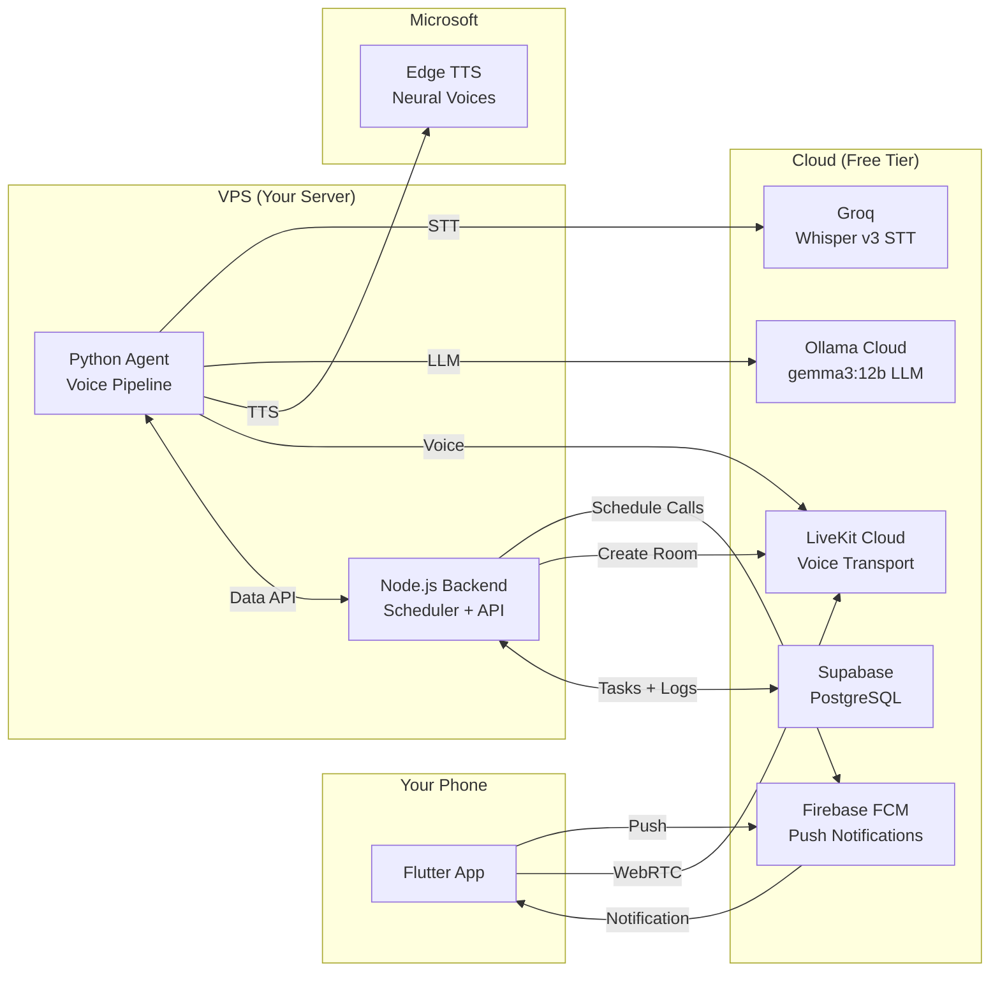
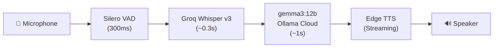

<div align="center">

# 🤖 J.A.R.V.I.S.

**AI Accountability Companion**

*An AI that comes to you first — proactive voice calls, accountability follow-ups, persistent memory. Not a chatbot. An AI relationship layer that refuses to let you disappear from your own goals.*

[](https://opensource.org/licenses/MIT)
[](https://python.org)
[](https://nodejs.org)
[](https://flutter.dev)
[](https://livekit.io)
[](CONTRIBUTING.md)

</div>

---

## 🎯 What It Does

Jarvis **calls you** — not the other way around. It's a voice-based accountability system that:

- ☎️ **Wakes you up at 5 AM** with a structured morning protocol (identity verification, tech quiz, schedule review)
- 📋 **Checks in throughout the day** — tracks tasks, gym, food, coding, reading
- 🌙 **Reviews your night** — scores your day across 5 pillars, holds you accountable
- 🔁 **Retries with escalation** — if you miss a call, it calls again every 20 minutes up to 6 times
- 🧠 **Remembers who you are** — identity verification ("I'm Tony Stark") before every call

### The Wakeup Call

```
🤖 "Identity verification required. State your code."
👤 "I'm Tony Stark"
🤖 "Verified. Good morning, Mr. Stark."
🤖 "It is Friday, 23 May 2025, 05:00 AM IST. Day 143 of the year. 222 days remaining."
🤖 "Let's begin. Question 1 — Technology: What is the primary cryptographic algorithm used in Bitcoin?"
👤 "SHA-256"
🤖 "Correct. Moving to cybersecurity..."
```

---

## ✨ Features

| Feature | Description |
|---------|-------------|
| 🔊 **Voice-First** | Real-time voice calls via LiveKit, not text |
| 🗣️ **Streaming TTS** | Sentence-by-sentence audio — no waiting for full response |
| ⚡ **Sub-second STT** | Groq Whisper v3 for instant speech recognition |
| 🔄 **Auto-Retry** | Missed wakeup? Calls again every 20 min, up to 6 times |
| 📱 **Push Notifications** | FCM rings your phone like a real call |
| 📊 **5-Pillar Tracking** | Food, Gym, Code, Office, Books — scored nightly |
| 🔐 **Identity Verification** | "State your code" — no unauthorized access |
| 💾 **Task Persistence** | PostgreSQL stores your schedule, logs, scores |
| 🆓 **100% Free** | No paid services. Groq + Ollama + Edge TTS + LiveKit free tiers |

---

## 🏗️ Architecture



### Voice Pipeline



**Total time-to-first-audio: ~2 seconds**

---

## 💰 Cost

| Service | Tier | Monthly Cost |
|---------|------|:------------:|
| Groq Whisper | Free | **$0** |
| Ollama Cloud | Free | **$0** |
| Edge TTS | Free | **$0** |
| LiveKit Cloud | Free (10k min/mo) | **$0** |
| Supabase | Free | **$0** |
| Firebase FCM | Free | **$0** |
| VPS | Any 2+ core | ~$5-10 |

**Total: $0 + VPS.**

---

## 🚀 Quick Start

### Prerequisites

- Node.js 18+, Python 3.12+, Flutter 3.x
- A VPS (2+ cores, 4GB+ RAM)
- Free accounts: [Groq](https://console.groq.com), [Ollama](https://ollama.com), [LiveKit Cloud](https://cloud.livekit.io), [Supabase](https://supabase.com), [Firebase](https://firebase.google.com)

### 1. Clone & Configure

```bash
git clone https://github.com/Manibharadwaj/jarvis.git
cd jarvis
cp .env.example .env
# Edit .env with your API keys
```

### 2. Set Up Database

Create a Supabase project and run the SQL migrations in `db/` against it.

### 3. Start the Server

```bash
# Install Python dependencies
cd agent && python -m venv venv && source venv/bin/activate
pip install -r requirements.txt

# Install Node.js dependencies
cd ../backend && npm install

# Start everything
cd .. && ./start.sh start
```

### 4. Set Up the App

```bash
cd app
flutter pub get
# Add your google-services.json (see google-services.json.example)
flutter run
```

### 5. Test a Call

```bash
curl -X POST http://localhost:3000/api/test/call \
  -H "Content-Type: application/json" \
  -d '{"type":"wakeup"}'
```

Your phone rings. You answer. Jarvis starts the protocol.

---

## ⚙️ Configuration

All configuration is in `.env`. Copy `.env.example` to get started:

| Variable | Description | Default |
|----------|-------------|---------|
| `OLLAMA_API_KEY` | Ollama Cloud API key | — |
| `OLLAMA_BASE_URL` | Ollama Cloud endpoint | `https://ollama.com/v1` |
| `OLLAMA_MODEL` | LLM model | `gemma3:12b` |
| `GROQ_API_KEY` | Groq API key (for STT) | — |
| `GROQ_BASE_URL` | Groq endpoint | `https://api.groq.com/openai/v1` |
| `STT_MODEL` | Whisper model | `whisper-large-v3` |
| `LIVEKIT_URL` | LiveKit Cloud WebSocket URL | — |
| `LIVEKIT_API_KEY` | LiveKit API key | — |
| `LIVEKIT_API_SECRET` | LiveKit API secret | — |
| `EDGE_TTS_VOICE` | Microsoft neural voice | `en-GB-RyanNeural` |
| `DATABASE_URL` | PostgreSQL connection string | — |
| `AGENT_SECRET` | Shared secret for agent↔backend auth | — |

---

## 🗓️ Call Schedule

| Time (IST) | Call Type | Protocol |
|:----------:|:---------:|----------|
| 05:00 AM | 🔆 Wakeup | Identity verify → Quiz → Schedule review → Focus plan |
| 05:20-06:40 | 🔁 Wakeup retries | Every 20 min if missed (up to 6 times) |
| 08:00 AM | ✅ Check-in | Identity verify → Task review → Next task |
| 12:00 PM | ✅ Check-in | Same protocol |
| 04:00 PM | ✅ Check-in | Same protocol |
| 08:00 PM | 🌙 Evening | Identity verify → Task review → 5 pillars → Day score |
| 11:00 PM | 🌙 Night review | Final accountability check |

---

## 📁 Project Structure

```
jarvis/
├── agent/             # LiveKit Voice Agent (Python)
│   ├── agent.py         # Main pipeline — STT/LLM/TTS + protocols
│   └── requirements.txt
├── backend/           # Fastify API server (Node.js)
│   ├── src/server.js    # Routes, scheduler, push notifications
│   └── service-account.json  # Firebase (gitignored)
├── app/               # Flutter mobile app
│   └── lib/
│       ├── screens/      # Home, Call, History, Tasks, Calendar
│       ├── database/      # Local SQLite
│       └── config.dart   # Server URL config
├── db/                # PostgreSQL migrations
│   └── 001-007_*.sql   # Schema + seed data
├── .env.example       # Template for all environment variables
├── start.sh           # One-command service startup
├── PLAN.md            # Architecture planning doc
└── README.md          # This file
```

---

## 🗺️ Roadmap

- [x] Voice pipeline (LiveKit Agent → STT → LLM → TTS)
- [x] Identity verification protocol
- [x] Morning wakeup with quiz + schedule review
- [x] Check-in and evening review calls
- [x] Push notification call triggering
- [x] Scheduled call retries with escalation
- [x] Streaming TTS for faster responses
- [x] Groq Whisper v3 for sub-second STT
- [ ] Persistent memory across calls (pgvector)
- [ ] Emotional state detection
- [ ] Inside jokes and relationship building
- [ ] Chat fallback for missed calls
- [ ] Code session tracking (6:30-10:30 PM)
- [ ] Dashboard with streaks and mood trends

---

## 📄 License

This project is licensed under the MIT License — see the [LICENSE](LICENSE) file for details.

<div align="center">

**Built with ❤️ and accountability**

</div>